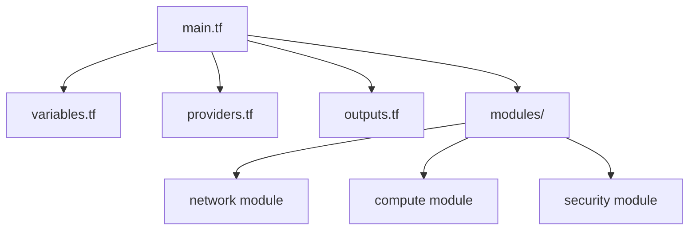
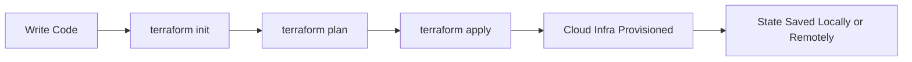
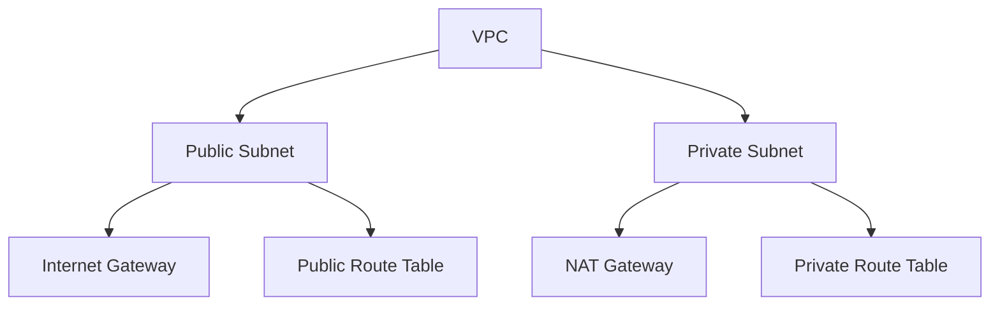
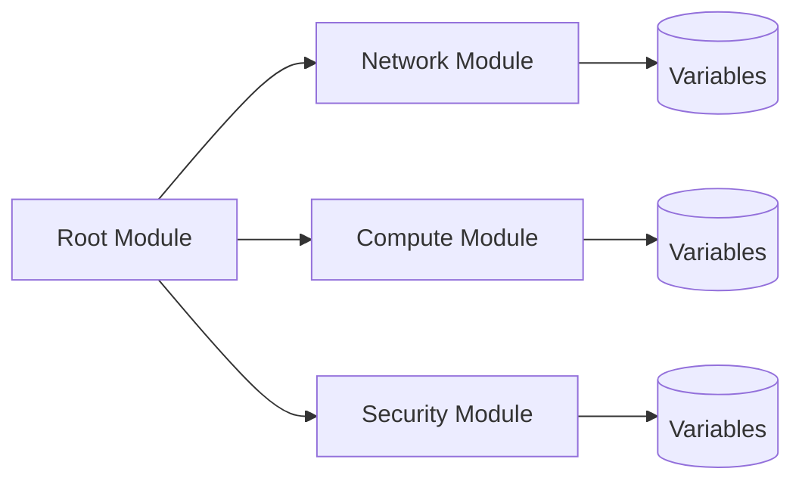
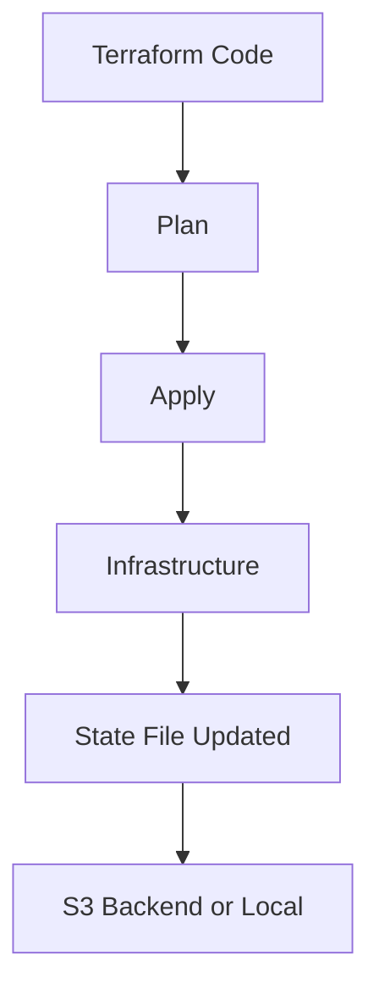
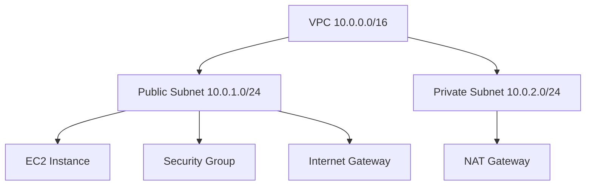

# 🌍 **terraform-infra-as-code **

👤 **Author:** [Arkan Tandel](https://www.github.com/arkantandel)
– Complete Understanding With Real Concepts & Diagrams**

Welcome to the **Terraform Master README**
Created by **[Arkan Tandel](https://www.github.com/arkantandel)**** — this guide is created to help you understand Terraform like you are *teaching it to someone else*. Instead of basic definitions, this document explains **why**, **how**, and **where** Terraform is used in real DevOps environments.

---

## 🚀 **What is Terraform (In the Real World)?**

Terraform is not just a tool — it is the **language of cloud automation**.

In companies, Terraform is used so that infra teams don’t manually click on AWS services. Instead, they write code that:

* Builds infra
* Updates infra
* Destroys infra
* Tracks infra states
* Works same across all clouds (AWS, Azure, GCP)

Terraform turns infrastructure into **version-controlled software**.

---

## 🧠 **How Terraform Actually Works Internally**

Terraform has a simple cycle but very deep logic underneath:

1. **You write the desired infra** (what you WANT).
2. **Terraform compares it with real cloud state** (what EXISTS).
3. **Terraform creates a plan** showing changes.
4. **Terraform applies the plan** and updates the state.

This is called **Declarative Infrastructure**, not step-by-step scripting.

---

## 📦 **Terraform Project Structure (High-Level Architecture)**

Below is the blueprint of how organizations structure Terraform at scale:



This modular approach helps teams manage thousands of resources efficiently.

---

## 🏗️ **Terraform Flow Explained Visually**



This is the core lifecycle every DevOps engineer follows.

---

## 🌐 **VPC Creation Using Terraform (Concept Explanation)**

Below is the high-level diagram for building a VPC with Terraform:



Terraform helps convert such cloud designs into clean, reusable code.

---

## 🧩 **How Terraform Modules Work (Explaining to Team)**

Modules are like **reusable machines**. You define infra once and use it many times.



Teams use modules to prevent duplicate code across environments (dev, qa, prod).

---

## 🔐 **Terraform State (The Most Important Part)**

State is the **brain** of Terraform.

It tells Terraform:

* What exists in AWS
* What Terraform created
* What needs changes

Without `terraform.tfstate`, Terraform becomes blind.

Below is the state flow:



Companies always store state in **S3 + DynamoDB Locking** to avoid conflicts.

---

## 🏛️ **Environment Separation Like a Professional**

Real companies use separate folders for each environment:

```
production/
  - main.tf
  - variables.tf
  - backend.tf
staging/
  - main.tf
  - variables.tf
  - backend.tf
development/
  - main.tf
  - variables.tf
  - backend.tf
modules/
  - vpc/
  - ec2/
  - sg/
```

This ensures clean CI/CD pipelines and avoids production mistakes.

---

## 🔥 **Sample Terraform Commands Explained Like a Trainer**

* `terraform init` → Downloads providers and modules.
* `terraform plan` → Shows EXACT changes before applying.
* `terraform apply` → Creates or updates infrastructure.
* `terraform destroy` → Removes infra safely.
* `terraform fmt` → Formats and cleans your code.
* `terraform validate` → Ensures your code is correct.

---

## 🧪 **Practical Demo – EC2 + VPC Infra Overview**

This diagram explains a Terraform-powered AWS architecture:



---

## 🎯 **Conclusion**

Terraform is not just a tool — it is a **mindset**.
It helps teams:

* Automate EVERYTHING
* Remove manual work
* Prevent configuration drift
* Standardize environments
* Improve speed & reduce cloud cost

If you understand the logic behind Terraform, you can build ANY cloud architecture.


